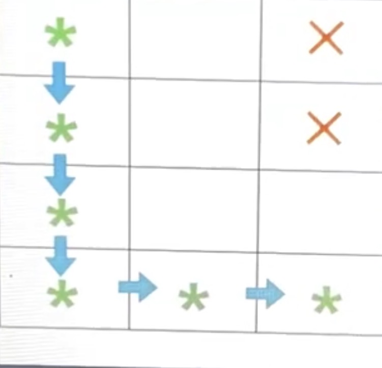

# Path Problem

Given an n x m grid, where rows are numbered from 1 to n and columns from 1 to m, there are x blocked cells. Their positions are specified by the array blockedPositions[i][] where blockedPositions[i][1] represents the row and blockedPositions[i][2] represents the column position, using 1-based indexing.

Starting from the top-left cell (1, 1), the goal is to reach the bottom-right cell (n, m) without visiting any blocked cells. Movement is allowed only up, down, left or right.

The strength of a path is defined as the minimum Manhattan distance from each cell in the path to the nearest blocked cell. To calculate the strength of a specified path, an array minDist[] is created, where minDist[i] represents the minimum distance of any blocked cell for the ith cell visited. The strength of the path is given by min(minDist[]).

Among all possible paths from (1, 1) to (n, m), determine the path that maximizes strength. If multiple paths have the same maximum strength, select the one that visits the fewest cells.

Return two integers: the maximum strength achievable and the minimum number of cells visited. If it is impossible to navigate from (1, 1) to (n, m), return [-1, -1].

Note: The Manhattan distance between cells (a, b) and (c, d) is defined as absolute value abs(a-c) + abs(b-d).

## Example

- n = 4
- m = 3
- blockedPositions = [[1, 3], [2, 3]]

On following the path as shown below: (1, 1) -> (2, 1) -> (3, 1) -> (4, 1) -> (4, 2) -> (4, 3).
The strength of the path = 2, and the number of cells visited = 6.
Therefore, the answer = [2, 6].

In the image, the red crosses represent the blocked positions, the green stars represent the cells visited, and the blue arrows represent the path.

## Function Description

Complete the function findOptimalPair in the editor below.

findOptimalPair has the following parameters:

- int n: the number of rows in the grid
- int m: the number of columns in the grid
- int blockedPositions[x][2]: the blocked positions

### Returns

- int[2]: the first integer represents the maximum strength possible, and the second represents the minimum number of cells visited with the maximum possible strength

## Constraints
